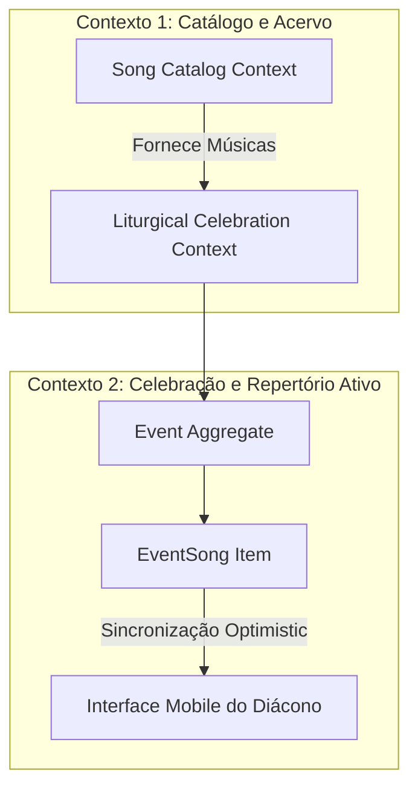
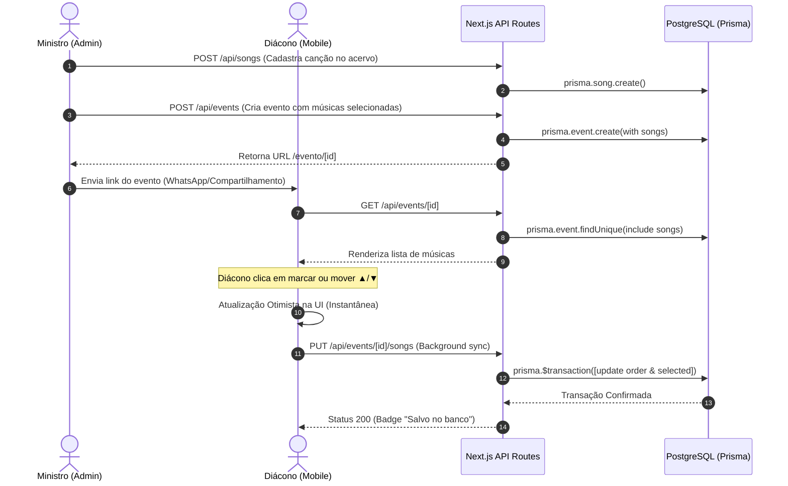

# 📖 Documentação de Domínio (Domain-Driven Design - DDD)
## Sistema de Gestão de Repertórios para Ministério de Adoração e Louvor Católico

---

## 1. Visão Geral do Domínio

O domínio compreende o planejamento, curadoria litúrgica e execução musical de momentos sagrados católicos (Adorações ao Santíssimo Sacramento, Missas, Vigílias e Grupos de Oração).

O desafio central que o software resolve é a comunicação fluida e em tempo real entre a **Equipe de Música** (que prepara e sugere o acervo) e a **Autoridade Litúrgica / Celebrante** (Diácono, Padre ou Coordenador), permitindo que a escolha e ordenação das músicas ocorram de forma rápida, móvel e sem atrito.

---

## 2. Linguagem Ubíqua (Ubiquitous Language)

| Termo | Definição no Domínio |
| :--- | :--- |
| **Acervo Geral (`Song`)** | Catálogo permanente de canções conhecidas pelo ministério, com título, ministério/artista e link de referência do YouTube. |
| **Celebração / Evento (`Event`)** | Um momento litúrgico específico datado (ex: *"Adoração ao Santíssimo - 25/09"*, *"Missa da Misericórdia"*). |
| **Música Sugerida (`EventSong`)** | Associação de uma música do acervo a uma celebração específica com estado de seleção e posição na sequência. |
| **Ordem de Execução (`order`)** | A sequência cronológica exata em que as músicas deverão ser entoadas durante a celebração. |
| **Música Marcada / Selecionada (`selected`)** | Estado que indica a confirmação pelo Diácono/Celebrante de que aquela canção fará parte do rito. |
| **Diácono / Celebrante** | Usuário final com acesso ao link direto mobile para triagem e ordenação do repertório da celebração. |
| **Administrador / Ministro de Louvor** | Usuário responsável por alimentar o acervo e estruturar novas celebrações. |

---

## 3. Contextos Delimitados (Bounded Contexts)



### 3.1. Contexto de Catálogo (`Song Catalog Context`)
- **Responsabilidade:** Manter a integridade e unicidade do acervo musical geral.
- **Entidades:** `Song`.
- **Operações:** Cadastro individual de canções, importação em lote via planilhas (`.xlsx`, `.xls`, `.csv`), consulta alfabética e pesquisa textual por título ou autor.

### 3.2. Contexto de Celebração e Execução (`Liturgical Celebration Context`)
- **Responsabilidade:** Orquestrar celebrações, montagem de repertórios sugeridos e recepção de escolhas em tempo real.
- **Entidades:** `Event`, `EventSong`.
- **Operações:** Criação de celebração com lista inicial, reordenação de sequência (`▲/▼`), marcação/desmarcação e sincronização atômica.

---

## 4. Modelagem Tática (Tactical Design)

### 4.1. Agregados e Raízes de Agregação (Aggregates & Roots)

#### **Agregado `Event` (Raiz de Agregação)**
Garante a consistência de uma celebração e a integridade da sua lista de músicas sugeridas.

```text
Event (Aggregate Root)
│
├── id: UUID
├── title: String (Ex: "Adoração 25/09")
├── createdAt: DateTime
│
└── songs: List<EventSong> (Entidades Filhas)
    ├── id: UUID
    ├── songId: UUID -> Referência para Song
    ├── selected: Boolean
    └── order: Integer (0..N)
```

**Invariantes do Agregado `Event`:**
1. Um evento não pode ter a mesma música duplicada (`@@unique([eventId, songId])`).
2. A ordem de execução `order` deve ser um valor inteiro que reflita a posição sequencial na playlist.
3. Atualizações de seleção e ordenação em lote são executadas em transação atômica (`prisma.$transaction`).

#### **Agregado `Song` (Raiz de Agregação)**
Mantém os dados fundamentais de uma música no acervo.

```text
Song (Aggregate Root)
├── id: UUID
├── title: String (Obrigatório, não vazio)
├── artist: String? (Opcional)
├── youtube: String? (URL válida do YouTube)
└── createdAt: DateTime
```

---

## 5. Arquitetura em Camadas e Mapeamento no Next.js App Router

```text
repertorio-catolico/
├── app/
│   ├── admin/page.tsx               # [Apresentação] Interface Desktop/Tablet do Administrador
│   ├── evento/[id]/page.tsx         # [Apresentação] Interface Mobile do Diácono (Optimistic UI)
│   ├── api/
│   │   ├── songs/route.ts           # [Aplicação] Use Case: Listar e Cadastrar Músicas
│   │   ├── events/route.ts          # [Aplicação] Use Case: Criar e Listar Celebrações
│   │   ├── events/[id]/route.ts     # [Aplicação] Use Case: Obter Detalhes da Celebração
│   │   └── events/[id]/songs/route.ts # [Aplicação] Use Case: Atualizar Ordem e Seleção Atômica
├── lib/
│   ├── prisma.ts                    # [Infraestrutura] Conexão Singleton com PostgreSQL
│   └── utils.ts                     # [Domínio / Utilitários] Sanitização e formatadores
├── prisma/
│   └── schema.prisma                # [Infraestrutura / Persistência] Mapeamento ORM
├── docs/
│   └── DDD.md                       # [Documentação] Especificação do Domínio
└── .github/workflows/
    └── deploy.yml                   # [DevOps] Esteira CI/CD de deploy na Vercel
```

---

## 6. Fluxo de Execução e Comunicação de Dados (Data Flow)



---

## 7. Roadmap e Próximas Iterações

Para as próximas fases do projeto, o modelo DDD está preparado para acomodar:

1. **Momento Litúrgico (`LiturgicalMoment` Enum/Value Object):**
   - Categorização das músicas em: *Entrada, Ato Penitencial, Glória, Salmo, Aclamação, Ofertório, Santo, Comunhão, Pós-Comunhão, Final*.
2. **Cifras e Tons (`KeySignature` & `Chords`):**
   - Associação do tom original (ex: `G`, `Em`) e suporte a transposição em tempo real para os instrumentistas.
3. **Módulo de Liturgia Diária Automática:**
   - Integração com APIs de leituras litúrgicas do dia (CNBB / Canção Nova) para sugestão inteligente de repertório.
4. **Relatório de Frequência de Canções:**
   - Métricas de quantas vezes uma canção foi tocada nos últimos 3 meses, evitando repetições excessivas.
